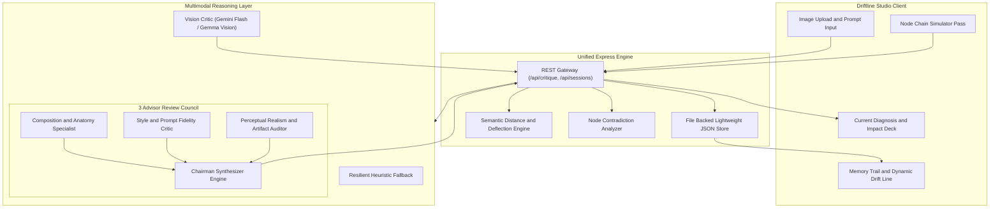

<div align="center">

# Driftline

**Visual Diagnostic and Anchor Drift Tracking Layer for Generative AI Pipelines**

Never regenerate blind again. Pin your foundational attempt, diagnose concrete structural and stylistic flaws, and trace iterative lineage across generative workflows.

[](https://driftline.onrender.com)
[](LICENSE)
[](https://nodejs.org)
[](https://vite.dev)
[](https://openrouter.ai)
[](https://render.com)

[Overview](#core-problem-and-value-proposition) • [Architecture](#system-architecture) • [Iteration Lineage](#the-dynamic-drift-line) • [Council Engine](#multi-advisor-council-layer) • [Pipeline Guard](#node-chain-disagreement-detector) • [Quick Start](#quick-start-guide)

</div>

---

## Core Problem and Value Proposition

Every modern creative AI platform converges on the same costly loop: enter prompt, generate, inspect visually, and regenerate repeatedly when results disappoint. None diagnose why an output failed or what specific parameter to alter before spending another generation credit.

Driftline introduces an intelligent diagnostic layer positioned immediately prior to the regeneration decision.

> [!IMPORTANT]
> **The Driftline Anchor Principle**
> Your very first prompt and visual output are pinned permanently as the immutable anchor. Every subsequent iteration traces a verifiable trajectory relative to this anchor. Driftline watches that line, calculates semantic variance, and alerts you when your creative exploration drifts away from your foundational artistic intent.

> [!NOTE]
> **Built for Studio Excellence**
> Designed for creative directors, prompt engineers, and visual artists using node based generation tools like Magnific, ImagineArt, and LTX Studio who need surgical feedback rather than generic advice.

---

## System Architecture



---

## Core Capabilities and Feature Catalog

| Feature | Operational Scope | Technical Mechanism | Strategic Benefit |
| :--- | :--- | :--- | :--- |
| **Critique Node** | Single model visual diagnosis | Multimodal vision prompt analyzing spatial depth, lighting, and anatomy | Replaces blind guesses with specific two to four sentence visual diagnosis |
| **High Leverage Rewrite** | Prompt optimization | Context aware prompt rewrite targeting the single primary bottleneck | One click editor update with surgical prompt modifications |
| **Confidence Impact Pill** | Regenerate calibration | Evaluates prompt structural variance as High Impact, Balanced, or Polish | Prevents credit waste on low leverage prompt micro tweaks |
| **Dynamic Memory Trail** | Iterative history visualization | Vertical timeline tracking order index, thumbnails, prompts, and deltas | Preserves complete creative lineage across generation attempts |
| **The Drift Line** | Continuous spatial deflection | SVG cubic bezier spline physically bending based on anchor variance | Immediate visual feedback on creative divergence from Attempt 1 |
| **Anchor Drift Audit** | Periodic intent check | Automated deep evaluation every third or fourth saved generation | Catches creative drift before projects diverge irreparably |
| **Review Council** | Multi advisor peer review | Three parallel domain specialist calls synthesized by Chairman | Eliminates single model bias and surfaces consensus confidence |
| **Chain Inspector** | Node pipeline contradiction check | Cross compares sequential nodes for conflicting generative flags | Flags issues like soft painterly nodes followed by sharp upscalers |

---

## The Dynamic Drift Line

The namesake mechanic of Driftline is the literal connecting line rendered alongside the iteration cards.

```
Anchor (Attempt 1)  ●  [Drift : 0%]   (Center Baseline)
                    │
Attempt 2           ╲  [Drift : 18%]  (Slight Deflection : Surgical Polish)
                     ●
                    ╱
Attempt 3          ●   [Drift : 42%]  (Moderate Deflection : Style Variance)
                    ╲
Attempt 4            ╲
                      ● [Drift : 84%] (High Deflection : Drift Alert Triggered)
```

1. **Center Baseline**: Attempt 1 establishes the root coordinate.
2. **Deflection Calculation**: Jaccard token variance and stylistic density shifts compute a numerical drift score between zero and one hundred.
3. **SVG Cubic Spline**: The visual path physically bends outward in real time, shifting color from Amber (Anchor) through Emerald (Aligned) to Rose (Drifted).
4. **Periodic Audit Banners**: Every third or fourth attempt introduces an explicit audit advising whether to realign with Attempt 1 or proceed with the new trajectory.

---

## Multi Advisor Council Layer

Adapted from Karpathy's LLM Council methodology, the Council Layer dispatches three independent domain specialists before reconciling their insights through a dedicated Chairman Synthesizer.

```
                   ┌──────────────────────────────────────────────┐
                   │               Generated Image                │
                   └──────────────────────┬───────────────────────┘
                                          │
                  ┌───────────────────────┼───────────────────────┐
                  ▼                       ▼                       ▼
       ┌─────────────────────┐ ┌─────────────────────┐ ┌─────────────────────┐
       │     Advisor 1       │ │     Advisor 2       │ │     Advisor 3       │
       │ Composition Specialist│ │ Style Fidelity Critic│ │  Artifact Auditor   │
       │  Framing, anatomy,  │ │  Palette harmony,   │ │  Edge smearing,     │
       │  focal separation   │ │  medium adherence   │ │  specular highlights│
       └──────────┬──────────┘ └──────────┬──────────┘ └──────────┬──────────┘
                  │                       │                       │
                  └───────────────────────┼───────────────────────┘
                                          │
                                          ▼
                               ┌─────────────────────┐
                               │  Chairman Synthesis │
                               │  Unified diagnosis, │
                               │  consensus score    │
                               └─────────────────────┘
```

* **Spatial and Anatomy Specialist**: Evaluates golden ratio, eye level perspective, facial proportion, and background separation.
* **Style and Intent Fidelity Critic**: Evaluates prompt instruction compliance, lighting directionality, and color palettes.
* **Artifact and Realism Auditor**: Scrutinizes unnatural surface smoothing, missing skin pores, and contradictory specular glares.
* **Chairman Synthesizer**: Produces the unified diagnosis, singular high impact prompt rewrite, and consensus rating.

---

## Node Chain Disagreement Detector

Generative workflows frequently chain multiple tools together, such as text to image generators, latent upscalers, and style transfer filters. When chained nodes carry opposing instructions, they cancel each other out while burning generation credits.

```
[Node 1: Base Generator]   "Soft dreamy watercolor, organic pastel brushstrokes"
           │
           ▼
[Node 2: Detail Upscaler]  "Aggressive 8k razor sharp micro detail, eliminate blur"
           │
           ▼
[Driftline Alert]          "CONTRADICTION DETECTED: Node 2 edge sharpening erases
                            the painterly brushstrokes established in Node 1."
```

Driftline inspects sequential node prompts, detects conflicting aesthetic directives, and suggests actionable corrections before running compute.

---

## Quick Start Guide

### Prerequisites

* Node.js version 18 or higher
* An OpenRouter API Key (multimodal vision support)

### 1. Clone the Repository

```bash
git clone https://github.com/mehanshbarthwal-lab/driftline.git
cd driftline
```

### 2. Configure Environment Variables

Create a `.env` file in the root directory:

```bash
cp .env.example .env
```

Configure your OpenRouter API key inside `.env`:

```env
PORT=3000
NODE_ENV=production
OPENROUTER_API_KEY=sk-or-v1-your-key-here
```

### 3. Install Dependencies and Build

```bash
npm install
npm run build
```

### 4. Launch Driftline Studio

```bash
npm start
```

Open your browser at `http://localhost:3000` to interact with Driftline Studio.

---

## Verification and Testing

Driftline includes built in test endpoints and sample creative scenarios.

### Automated Health and API Verification

```bash
# Verify system status and vision engine configuration
curl http://localhost:3000/api/health

# Verify session initialization
curl -X POST http://localhost:3000/api/sessions \
  -H "Content-Type: application/json" \
  -d '{"customId":"test_session"}'
```

### Preloaded Studio Scenarios

Driftline Studio includes three instant click presets accessible directly from the header navigation:

1. **Cyberpunk Alley Rain**: Tests atmospheric lighting separation and midtone wash diagnosis.
2. **Artisan Studio Portrait**: Tests Rembrandt lighting contrast and facial skin texture preservation.
3. **Brutalist Concrete Lounge**: Tests contact shadows and physical object grounding.

---

## Deployment to Render Cloud

Driftline is engineered for zero configuration deployment on Render free tier using a unified fullstack container.

1. Connect your GitHub repository to Render.
2. Create a new **Web Service**.
3. Select **Node** environment.
4. Set Build Command: `npm install && npm run build`
5. Set Start Command: `npm start`
6. Add Environment Variable:
   * `OPENROUTER_API_KEY` : `your_openrouter_api_key_here`
7. Click **Deploy Web Service**.

---

<div align="center">

Built with precision for the next generation of creative AI workflows.

</div>
